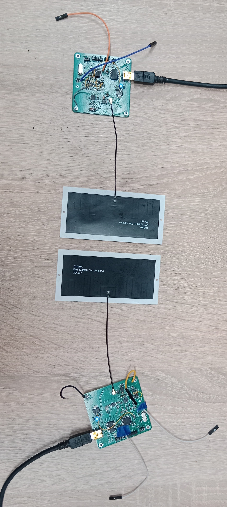

# Quadrature-amplitude-modulator

The goal of the project was to create two devices that would be wirelessly communicating with each other in simplex mode, using quadrature amplitude modulation at the 433 MHz band.

